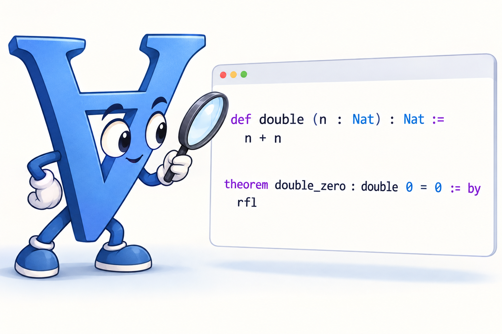

# EPFL CS550 - Formal Verification

[Moodle](https://moodle.epfl.ch/course/view.php?id=13051), [Coursebook](https://edu.epfl.ch/coursebook/en/formal-verification-CS-550?cb_cycle=bama_cyclemaster&cb_section=in)

This repository is the homepage of the course Formal Verification. It contains essential materials and links about course organization and learning.

### Staff

- Professor: [Viktor Kunčak](https://people.epfl.ch/viktor.kuncak)
- PhD Teaching Assistant: [Lazar Milikic](https://people.epfl.ch/lazar.milikic)
- Student Assistant: [Jacopo Moretti](https://people.epfl.ch/jacopo.moretti)

### Grading

The grade is based primarily on computer-based and paper-based exams done in class during the semester. A smaller part of the grade is based on a project done in groups and presented at the end of the semester. 

**Passing the course requires being present in several examinations throughout the semester.**

## Grade breakdown and grading mode ##

| Percentage | Work Description | Group/Individual | Submission | Date/Deadline |
| :--        | :--              | :--              | :--        | :--           |
| 5%         | first lab (using [Stainless](https://github.com/epfl-lara/stainless)) | group | Moodle | 2 October 20:00 |
| 5%         | second lab (using [Lean](https://lean-lang.org/))                   | **alone** | Moodle | 27 October 20:00 |
| 30%        | **in-class exam** solving problems in Lean on computers             | **alone** | **live** | 29 October 15:00-19:00 |
| 40%        | **in-class paper written exam**                                     | **alone** | **live** | November |
| 20%        | **final group projects and their presentations in class**            | group | **live** | last weeks of the semester |

### AI Policy

The use of LLMs is allowed for final group projects, but you need to document how you use them. You are also welcome to use search and AI tools to clarify your understanding of the material outside of the exams. Aside from commercial providers, note that you can use EPFL-hosted open-weight models available at https://chat.rcp.epfl.ch/ from within EPFL network.

# Content

In this course, we introduce formal verification as a principled approach for developing systems that do what they are expected to. One of the primary vehicles we use is [Lean](https://lean-lang.org/) language for programming and proving that comes with a large mathematics library and was also used to formalize, e.g., [Sphere packing results](https://arxiv.org/abs/2604.23468), the [proof of Fermat's last theorem](https://www.anthropic.com/research/formalizing-fermats-last-theorem) as well as the [Finite time blowup for Navier–Stokes and Euler equations](https://github.com/openai/NavierStokesAndEuler).

The course has two aspects:
- learning the practice of formal verification - how to use tools (Stainless, Lean) to construct verified software
- understanding the principles behind formal verification and the ways in which verification tools work

We will have the following types of activities:
  * Lecture hours where we introduce the material or hear a guest lecture
  * Exercise hours, which we hand out and do not grade, and that help you prepare for the in-class paper exam
  * Lab hours, where you work to solve the graded labs and ask questions, prepare for the in-class computer exam, and work on your final project
  * Final project presentations

### NOTE

To see the material, please visit https://mediaspace.epfl.ch , log in with your EPFL credentials and 
[select this channel](https://mediaspace.epfl.ch/channel/CS-550+Formal+Verification/30542). Slides and listings are attached underneath the videos.

### COURSE OUTLINE 

| Week | Day | Date       | Labs Active | Time  | Room   | Topic                           | Videos & Slides              |
| :--  | :-- | :--        | :--   | :--   | :--    | :--                             | :--                          |
| 1    | Thu | 10.09.2025 | ..... | 15:15 | [ELA2](https://plan.epfl.ch/?room==ELA%202) | Lecture 1 (PDF: [A](lectures/lecture01a.pdf), [B](lectures/lecture02a.pdf)) [(playlist)](https://mediaspace.epfl.ch/playlist/dedicated/30542/0_vw42tr2d/0_3z52dv8y) | [Intro to FV](https://mediaspace.epfl.ch/media/01-01%2C+What+is+Formal+VerificationF/0_3z52dv8y/30542), [Intro to Stainless](https://mediaspace.epfl.ch/media/01-02%2C+First+Steps+with+Stainless/0_tghlsgep/30542), [Auxiliary Assertions](https://mediaspace.epfl.ch/media/01-03%2C+Auxiliary+Assertions+in+Stainless/0_54yx91xi/30542), [Unfolding](https://mediaspace.epfl.ch/media/01-04%2C+Unfolding+recursive+functions+in+Stainless/0_4byxmv9i/30542), [Disasters, Successes, and Inductive Invariants](https://mediaspace.epfl.ch/media/01-05%2C+Disasters%2C+Successes%2C+and+Inductive+Invariants/0_fei98b8f) |
|      |     |            | ..... | 17:15 | [ELA2](https://plan.epfl.ch/?room==ELA%202) | Lecture 2 [(PDF)](lectures/lecture02.pdf) [(playlist)](https://mediaspace.epfl.ch/playlist/dedicated/30542/0_b3ga55fo/0_omextd9i)                       | [Dispenser Example](https://mediaspace.epfl.ch/media/02-01%2C+Dispenser+Example+of+Finite+System/0_omextd9i), [Finite Systems Expressed with Formulas](https://mediaspace.epfl.ch/media/02-02%2C+Finite+Systems+Expressed+with+Formulas/0_8a6q0uve) |
|      |     |            |       |       |        | Reading:                       | HandMC-Ch.10  |
|      |     |            |       |       |        | Follow:                        | [Stainless Tutorial Videos](https://mediaspace.epfl.ch/playlist/dedicated/30542/0_t2ld6vzn/0_azxgetu9) and [materials](https://epfl-lara.github.io/asplos2022tutorial/)  |
|      | Fri | 11.09.2025 | ..... | 13:15 | [INR219](https://plan.epfl.ch/?room==INR%20219) | [Lecture 3] (PDF: [A](lectures/lecture03a.pdf), [B](lectures/lecture03b.pdf)) [(playlist)](https://mediaspace.epfl.ch/playlist/dedicated/30542/0_thr9uebs/0_tv48ew7w)                       | [What is a Formal Proof?](https://mediaspace.epfl.ch/playlist/dedicated/30542/0_thr9uebs/0_tv48ew7w) and [Propositional Resolution](https://mediaspace.epfl.ch/playlist/dedicated/30542/0_thr9uebs/0_lovmc46b) |
| 2    | Thu | 17.09.2025 | 1.... | 15:15 | [ELA2](https://plan.epfl.ch/?room==ELA%202) | [Lab 1](labs/lab1/README.md) | Stainless |
|      |     |            | 1.... | 17:15 | [ELA2](https://plan.epfl.ch/?room==ELA%202) | [Lab 1](labs/lab1/README.md) | Stainless |
|      | Fri | 18.09.2025 | 1.... | 13:15 | [INR219](https://plan.epfl.ch/?room==INR%20219) | Exercises 1 | Propositional logic, Transition Systems |
| 3    | Thu | 24.09.2025 | 1.... | 15:15 | [ELA2](https://plan.epfl.ch/?room==ELA%202) | finish [Lecture 3](lectures/lecture03b.pdf) | [Propositional Resolution](https://mediaspace.epfl.ch/playlist/dedicated/30542/0_thr9uebs/0_lovmc46b) |
|      |     |            | 1.... | 16:15 | [BC420](https://plan.epfl.ch/?room==BC%20420) | Guest Lecture | [IC Colloquium: Abstract Interpretation on irregular programming environments](https://memento.epfl.ch/event/ic-colloquium-abstract-interpretation-on-irregul-2/). Background: [Abstract Interpretation in a Nutshell](https://www.di.ens.fr/~cousot/AI/IntroAbsInt.html) |
|      |     |            | 1.... | 17:15 | [ELA2](https://plan.epfl.ch/?room==ELA%202) | [Lab 1](labs/lab1/README.md) | Stainless |
|      | Fri | 25.09.2025 | ..... | 13:15 | [INR219](https://plan.epfl.ch/?room==INR%20219) | Lecture | Proof Systems for First-Order Logic |

### Books

* Lean documentation: https://lean-lang.org/learn/
* Scala documentation (for first lab, optionally project): https://docs.scala-lang.org/
* [CalComp] **The Calculus of Computation - Decision Procedures with Applications to Verification**, 2007, [from Springer](https://doi.org/10.1007/978-3-540-74113-8), [from EPFL library](https://www.epfl.ch/campus/library/beast/?isbn=9783540741138), by Aaron Bradley and Zohar Manna.
* [HandMC] **Handbook of Model Checking**, 2018, from [from Springer](https://link.springer.com/book/10.1007/978-3-319-10575-8), [from EPFL Library](https://library.epfl.ch/en/beast?isbn=9783319105758), edited by Edmund M. Clarke, Thomas A. Henzinger, Helmut Veith, Roderick Bloem.
* [HandAR] **Handbook of Practical Logic and Automated Reasoning**, 2009, [from Cambridge University Press](https://doi.org/10.1017/CBO9780511576430) and [from EPFL Library](https://library.epfl.ch/en/beast?isbn=9786612058776), by John Harrison
